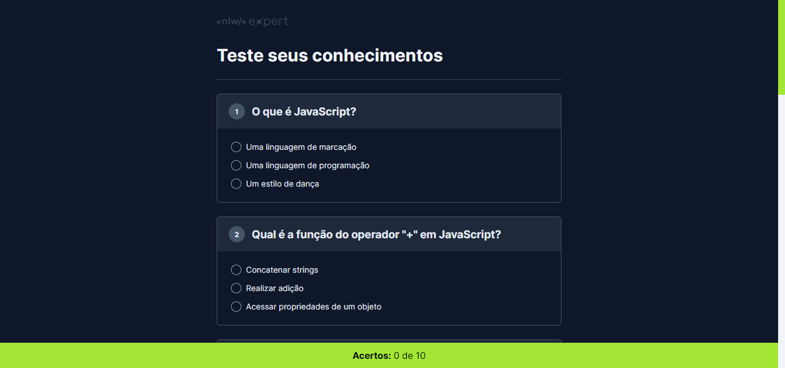

# NLW Expert | Rocketseat

## NLW Expert Quiz

#### Quiz

## Índice

- [Título e Imagem de capa](#nlw-expert-quiz)
- [Descrição do projeto](#-descrição-do-projeto)
- [Tecnologias Utilizadas](#-tecnologias-utilizadas)
- [Deploy](#-deploy)
- [Desenvolvido](#-desenvolvido-por)
- [Licença](#%EF%B8%8F-licença)

## 📄 Descrição do Projeto

Essa aplicação foi desenvolvida durante o NLW Experts da Rocketseat utilizando HTML, CSS e JavaScript.

## 🛠 Tecnologias Utilizadas

    
    
    
    
    
    

## 🚀 Deploy

Usei a própria ferramenta de deploy do GitHub, [Clique Aqui]() para ver o projeto.

## 🚧 Desenvolvido Por 
`Misla Wislaine` 

## 🗂️ Licença

Este projeto está sob a licença [MIT](LICENSE).